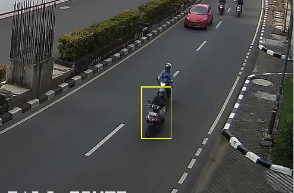
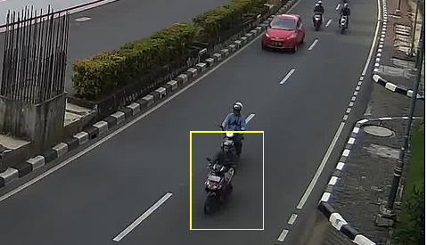
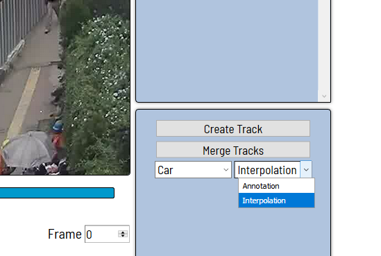
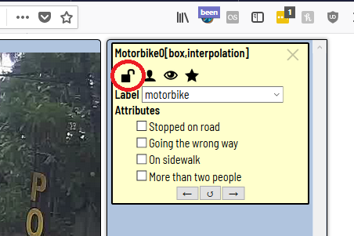
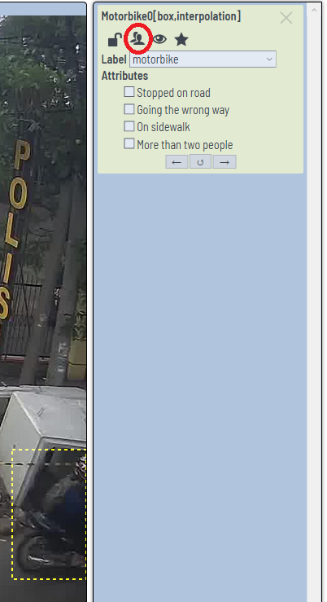
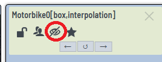
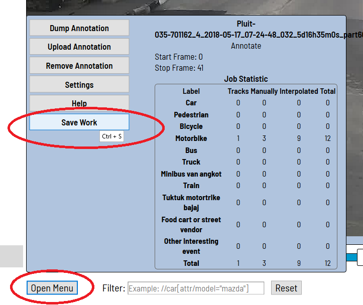

# Video Annotation Tool Quick Start Guide

Welcome to the Video Annotation Tool! Here we provide a quick guide for using the Computer Vision Annotation Tool (CVAT), with examples drawn from Jakarta. Whether you are annotating videos yourself, or having others do so, it is an important part of the workflow. Video annotation allows for validation of the various models that we include, and can give an indication for how well they're working, and whether they need retraining.

To get started, the basic operation in this tool is drawing a bounding box.

**To draw a box around an object, click "Create Track."** Then, draw a box by clicking a corner and dragging it to the opposite corner of the desired object. The boxes should be tightly drawn around the object.

**Good**:

**Bad**:

**You should create a track around an object in the first frame for which that object is visible.** If you notice an object partway through the video, you should first go back to find the first frame for which it is visible, and then draw a box on that first frame.

Note the following menu should always be set to interpolation:

Annotation mode is used for single frame annotations, and therefore not relevant for annotating entire videos.

**All objects should have boxes around them.** There are different strategies to achieve this, but we suggest that you annotate one object in the first frame when it appears, and keep annotating that object until it leaves the field of view, or the video ends.

**To move between frames, we suggest using the keyboard shortcuts D (to go backwards) and F (to go forward).**

Once an object is fully annotated, or if you want to not change it temporarily, you can **lock it**:

**If an object is only partially visible, you should mark it as occluded:**

The box around the object will now be drawn with a dashed line. It is important to do this for the first frame when it's occluded, and to uncheck it if the object becomes completely visible again. (Note: "occluded" might mean it is partially out of frame, as above, or it oculd simply be behind something.)

**It is important to mark the object as having left the field of view in the first frame you can no longer see it!**

**You don't need to change the position of the box in every single frame.** You can skip some number of frames, then move the box as appropriate. You should then go back and check if the box looks good in the frames you skipped: the motion is interpolated between the boxes you set manualy, which sometimes works well, but needs to be fixed if the object's motion is changing from frame to frame.

**Once you're done, or anytime you want to take a break, please remember to save your work.** You can do this by clicking "Open Menu" in the lower-left corner, and then "Save Work." 

**Note**: Most buttons have keyboard shortcuts, and will show you the corresponding shortcut if you hover over them.

**To summarize, here is the recommended workflow**:
1. Pick an object, and find its earliest occurrence in the video.
2. Draw a box around that object and select the right label.
3. Skip ahead, skipping 5-10 frames or until the object has moved significantly.
4. Move the object's box to its new location.
5. If the object is occluded in the current frame, mark it as such (if it was occluded but isn't anymore, then un-mark it).
6. Check the video between the current frame and the previously annotated frame to make sure the box follows the object. If it does not, move the box as appropriate to correct it.
7. Continue moving forward in the video, adjusting the box as necessary, until the box leaves the frame. Make sure that on the first frame not containing the object, you mark it as "out of frame."
8. Lock the object so that you don't mistakenly change it again.
9. Save your work after every object.
10. Repeat steps 1-9 for a new object, until no more objects are un-annotated.
11. Save your work at the end.
